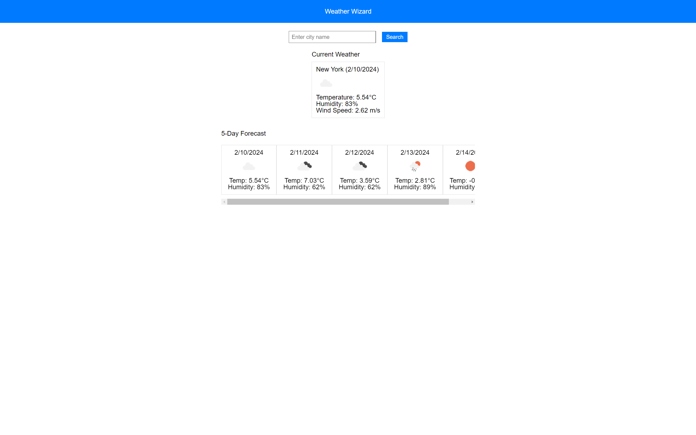

# Weather Wizard

## Description
Weather Wizard is a weather dashboard application that allows users to see the current weather and 5-day forecast for multiple cities. It utilizes the OpenWeatherMap API to retrieve weather data and dynamically updates the HTML and CSS to display the information.

## Screenshots

## Deployed Application
[Weather Wizard](https://dash365.github.io/Weather-Wizard/)

## How to Use
1. Enter the name of a city in the search bar and click the "Search" button.
2. The current weather and 5-day forecast for the entered city will be displayed.
3. Previously searched cities will be shown in the search history.

## Technologies Used
- HTML
- CSS
- JavaScript
- OpenWeatherMap API

## License
This project is licensed under the [MIT License](LICENSE).
